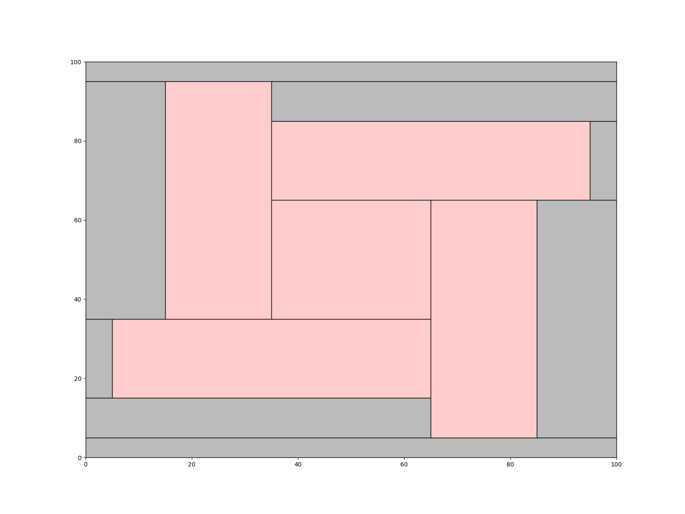

# Lab1 - Corner Stitching
Implement the data stucture - "Corner Stitching"[1].

Input and output formats please refer to [Lab1.pdf](./Lab1.pdf).

## Demonstration
* case0


* case1


* case2


* case7


## Makefile command
```
cd src
make -j4
```
## Execute command
```
./Lab1 <testcase> <output> 
```
## Draw command
1. create drawing files and result also
```
./Lab1 <-input case> <-output out> <-draw layout>
```
* example
```
./Lab1 -input ../case/case0.txt -output ../out/output0.txt -draw ../layout/layout0.txt
```
2. draw using draw_block_layout.py
```
python3 draw_block_layout.py <layout.txt> <layout.png>
```
* example
```
python3 draw_block_layout.py layout0.txt layout0.png
```

## Reference 
* \[1\][J. K. Ousterhout, "Corner Stitching: A Data-Structuring Technique for VLSI Layout Tools," in IEEE Transactions on Computer-Aided Design of Integrated Circuits and Systems, vol. 3, no. 1, pp. 87-100, January 1984, doi: 10.1109/TCAD.1984.1270061.](https://ieeexplore.ieee.org/abstract/document/1270061)