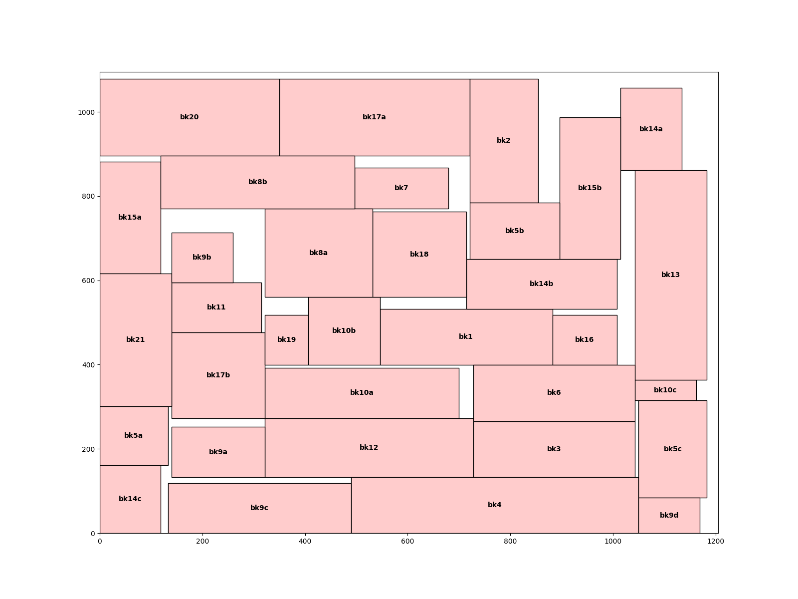
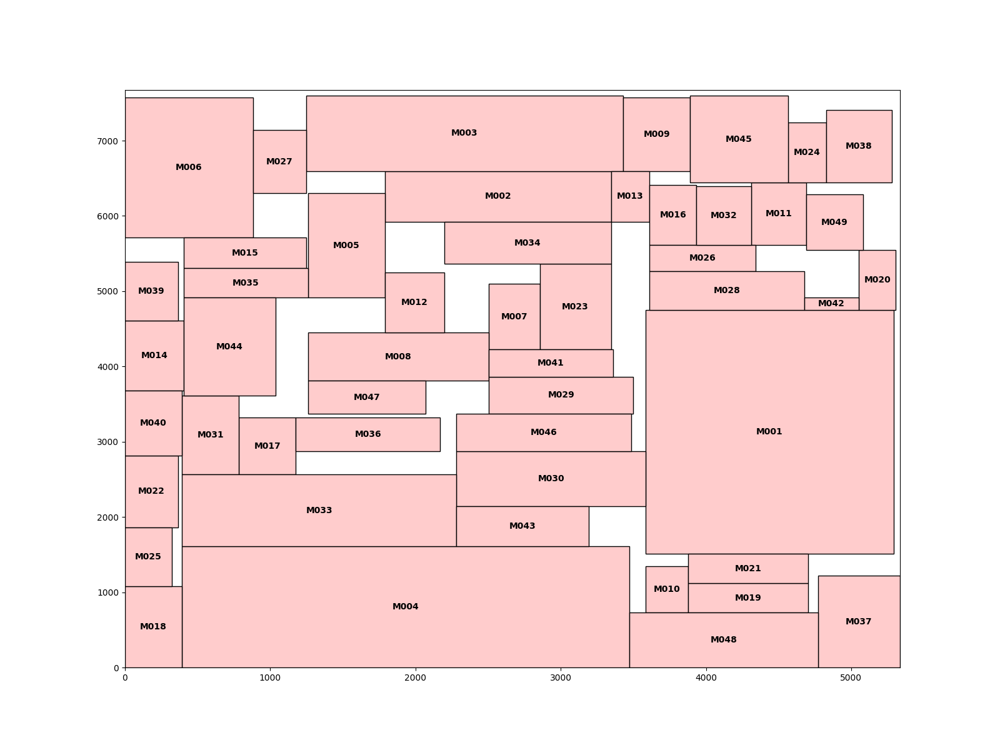
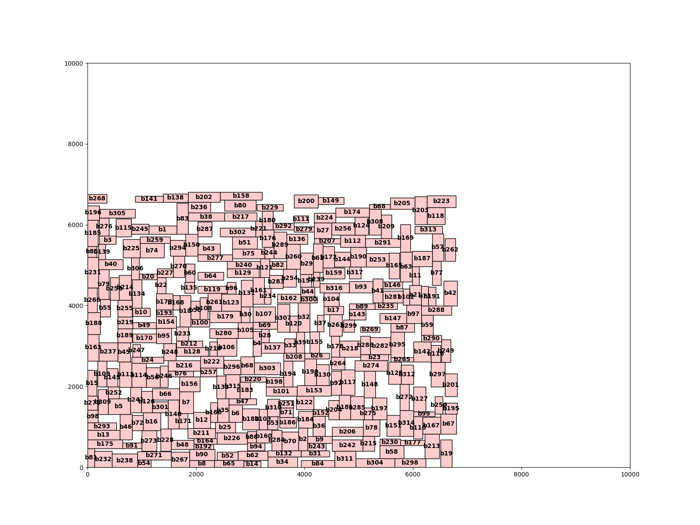

# Lab2 - Fixed Outline Floorplanning
Problem: Fixed-outline floorplanner that can
handle hard macros.

Method: Sequence Pair(SP)[1]

Input and output formats please refer to [Lab2.pdf](./Lab2.pdf).
## Demonstration
* ami33


* ami49


* vda317b


## Makefile command
```
make -j4
```

## Execute command
```
./Lab2 <α value> <input.block> <input.net> <output> 
```
* example
```
./Lab2 0.5 ami33/ami33.block ./ami33/ami33.nets ./out/ami33.txt
```
## Draw command
```
python3 draw_block_layout.py ./drawing/<text output> <drawing output>
```
* example
```
python3 draw_block_layout.py ./drawing/ami33.txt ./drawing/ami33.png 
```
## Reference 
* \[1\][H. Murata, K. Fujiyoshi, S. Nakatake, and Y. Kajitani, “Rectangle packing-based module placement,” in Proceedings of IEEE International Conference on Computer Aided Design, 1995, pp. 472–479.](https://ieeexplore.ieee.org/document/480159)