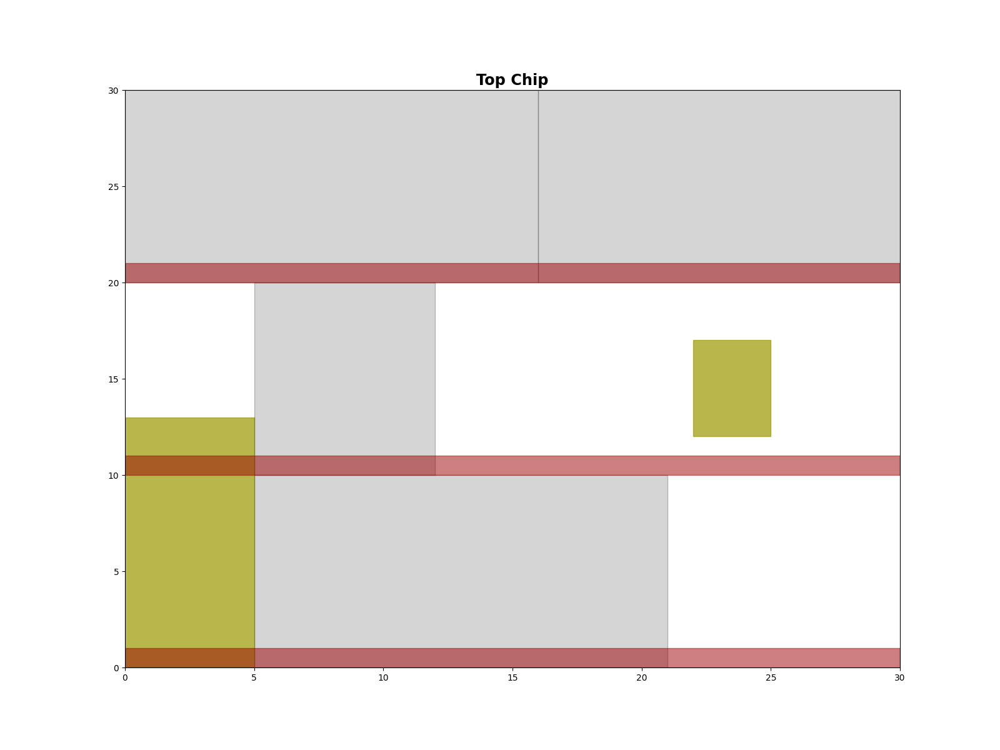
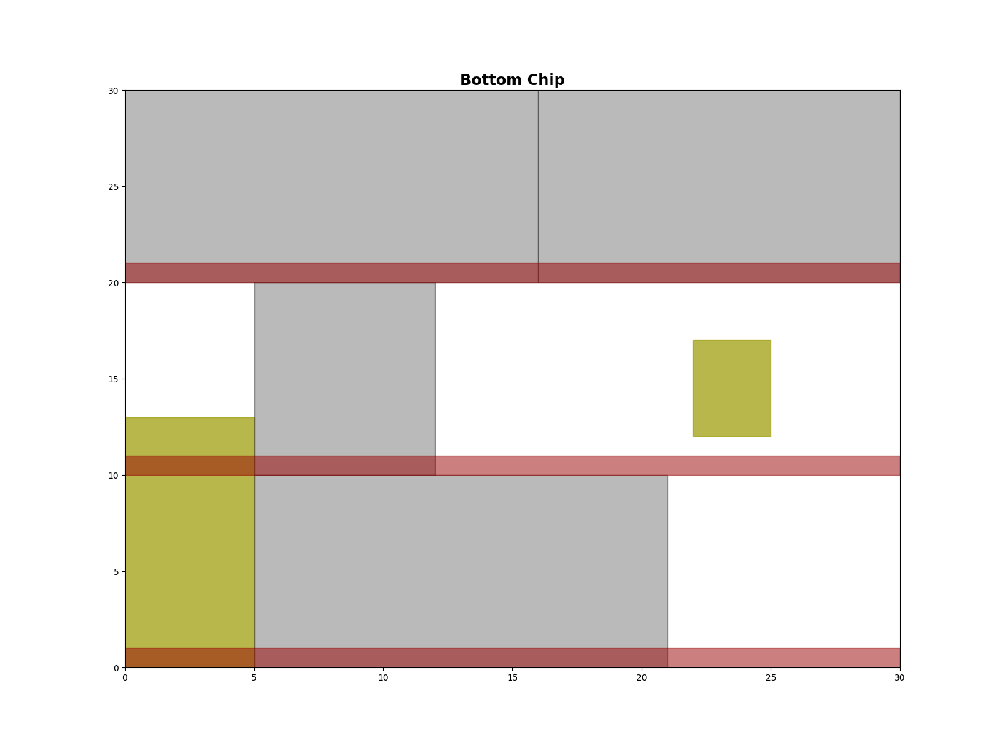
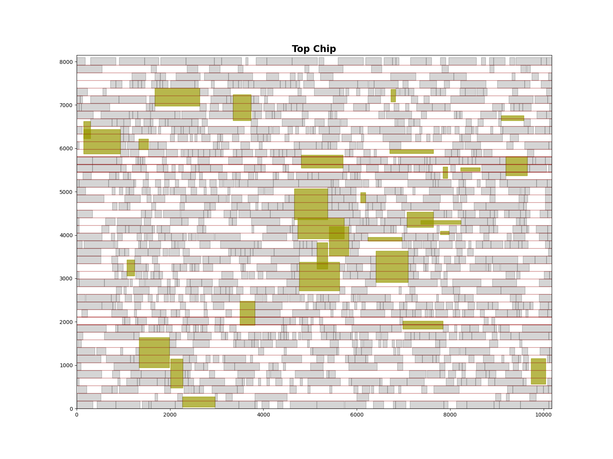
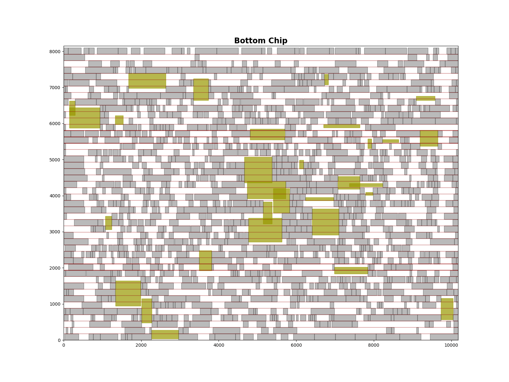
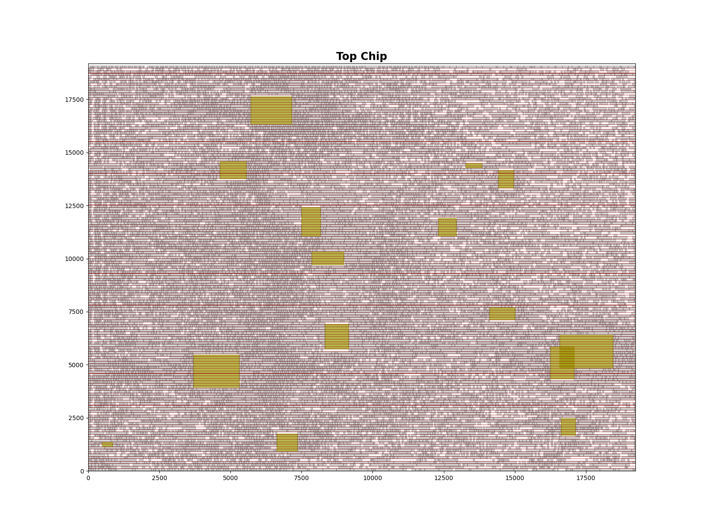

# Lab3 - Multi-chip Partition and Placement
Partition cells into two chips and legalize all standard cells without overlap.

Use FM partition[1] and Abacus legalization[2] to solve it.

Input and output formats please refer to [Lab3.pdf](./Lab3.pdf).
## Demonstration
* case1
    * top die
        
    * bot die
        
* case2
    * top die
        
    * bot die
        
* case3
    * top die
        
    * bot die
        
* case4
    * top die
        
    * bot die
        

## Makefile command
```
make -j4
```

## Execute command
```
./Lab3 <input> <output>
```
* example
```
./Lab3 ./case/case1.txt ./out/case1.txt
```
## Draw command
```
python3 draw.py <input> <output> <drawing output>
```
* example
```
python3 draw.py case/case3.txt out/case3.txt drawing/case3/layout3
```
## Reference 
* \[1\][C. M. Fiduccia and R. M. Mattheyses, "A linear-time heuristic for improving network partitions," in Proc. 19th Design Autom. Conf., 1982,pp. 241–247](https://ieeexplore.ieee.org/document/1585498)
* \[2\][P. Spindler, U. Schlichtmann, and . M. Johannes, Abacus: fast legalization of standard cell circuits with minimal movement, ISPD’08, 2008](https://dl.acm.org/doi/10.1145/1353629.1353640)