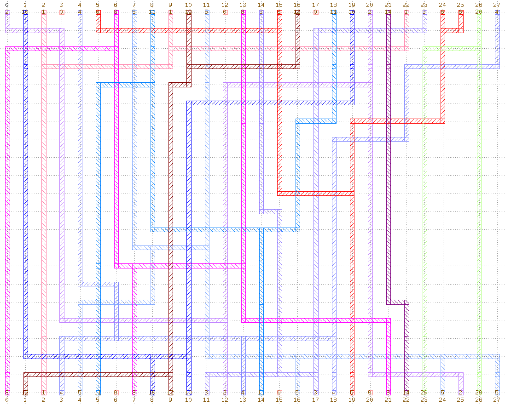

# Lab4 - Channel Router
Problem: Implement a 2-layer detailed router to complete channel routing.

Method: Greedy Channel Router[1]

Input and output formats please refer to [Lab4.pdf](./Lab4.pdf).

## Demonstration
* case1
 

* case2


* case3(Deutsch difficult case)

Download [case1.gds](./drawing/case1.gds), [case2.gds](./drawing/case2.gds) and [case3.gds](./drawing/case3.gds) to see the details.

## Makefile command
```
make -j4
```

## Execute command
```
./Lab4 <input> <output> [drawing output]
```
* example
```
./Lab4 ./case/case1.txt ./out/case1.txt ./drawing/case1
```

## Log
* case1: 15 tracks with GreedyRouter(20, 1, 0)
* case2: 18 tracks with GreedyRouter(20, 1, 0)
* case3: 21 tracks with GreedyRouter(9, 2, 6)

## Reference 
* \[1\][Ho T.-T., S. S. Iyengar, and S.-Q. Zheng, A General  Greedy Channel Routing Algorithm, IEEE Trans. on CAD of Integrated Circuits and Systems, vol. 10, pp. 204-211, 1991.](https://ieeexplore.ieee.org/document/1585533/citations?tabFilter=papers#citations)
